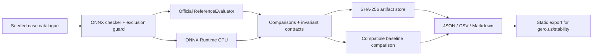

# Архитектура gero.uz / Numerical Observatory

Платформа отвечает на инженерный вопрос: «В каком окружении, на каком входе и при каком математическом контракте меняется результат?» Публичная единица данных — проверяемое наблюдение, а не заголовок о баге.

## Реализованный прототип



`cases.py` определяет граф, семантику входов, параметры и эквивалентный граф. `backends.py` удерживает одинаковые настройки CPU, single-thread sequential execution и варианты оптимизации. `compare.py` отделяет shape/dtype/finite checks от численной ошибки. `invariants.py` задаёт операционные и metamorphic-контракты. `runner.py` выполняет матрицу и атрибутирует результаты. `storage.py` сохраняет доказательную базу и экспортирует статический сайт. `cli.py` — вход для CI и воспроизведения.

Нет сервиса приёма произвольных пользовательских моделей, многопользовательской авторизации, БД, очереди, GPU workers или публичного API. Нижеследующий production-контур является проектом развития, не описанием уже поднятой инфраструктуры.

## Контур production

Статические страницы и assets обслуживаются CDN. Read API (например FastAPI) читает PostgreSQL; объектное хранилище с S3-compatible API хранит неизменяемые графы, входы, сырые выходы и архивы. Очередь выдаёт задания worker-процессам с фиксированными образами. CPU и GPU workers разделены по provider/hardware capabilities. API принимает ссылки на разрешённые artifact IDs, а не исполняемый код.

Загрузка модели, если её добавлять, проходит ONNX checker, лимиты тензоров/файлов/времени, запрет внешних файлов и custom runtime extensions. Внешние веса сначала копируются в контролируемый artifact storage. Worker выполняется с лимитами CPU/RAM, read-only окружением, без исходящего сетевого доступа, с таймаутом и возможностью остановить весь процесс. Текущий CLI работает с собственными небольшими графами и не предоставляет эту изоляцию для публичных загрузок.

Неизменяемые run artifacts публикуются под хэшем. Индекс `latest` переключается атомарно только после успешной проверки полноты манифестов. Подготовка новых результатов не должна ломать ранее опубликованные downloads. Прототип использует локальные файлы и одного writer; для нескольких workers необходим transactional ingest и unique constraints.

## Модель данных

| Сущность | Ключ и содержание |
|---|---|
| GraphCase | case_id; protobuf hash; input hashes; axes; shapes; dtype; operation; domain |
| Environment | версии пакетов, build ID, source digest, CPU/GPU model, драйвер, provider, execution options |
| Run | run_id; config; started/completed; seed; environment_id; baseline_id |
| Observation | observation_id; comparison_key; case_id; environment_id; optimization; status; output_hash |
| Check | observation_id + contract_name + backend; pass/fail; metrics; tolerance; diagnostic |
| RunObservation | run_id + observation_id; измерения latency конкретного запуска |
| Candidate | независимый редакционный ID; связанные observations; причина; upstream status; duplicate_of |
| Artifact | SHA-256; MIME; size; storage key; public/private; integrity verification |

RunObservation позволяет дедуплицировать одно численное наблюдение, сохранив историю запусков и распределения latency. В текущем файловом прототипе aggregate выбирает первое идентичное наблюдение; все оригинальные run JSON остаются источником отдельных timings.

## Публичный API — проект контракта

```text
GET /api/v1/observations?operator=Softmax&dtype=float32&provider=CPUExecutionProvider&status=divergence&cursor=...
GET /api/v1/observations/{observation_id}
GET /api/v1/runs/{run_id}
GET /api/v1/benchmarks?run_id=...&group_by=operator
GET /api/v1/artifacts/{sha256}/download
GET /api/v1/candidates/{candidate_id}
POST /api/v1/private/runs
POST /api/v1/private/candidates/{id}/review
```

Фильтрация по allowlist, cursor pagination, предсказуемые sort keys. Для benchmark API всегда обязательны provider, hardware и version context. Артефакты неизменяемы, поддерживают ETag и длительное кеширование; индексы — короткое кеширование. Нельзя показывать aggregate GPU latency без указания модели GPU и версии драйвера.

## Состояния и публикация

Численный статус (`pass`, `divergence`, `invariant_violation`, `unsupported`, `execution_error`) независим от baseline-статуса (`regression`, `resolved`, `unchanged`, `not_assessed`, `new_coverage`, `incomparable_*`). Третий независимый статус — редакционный: candidate → locally reproduced → investigated → published; отдельно upstream reported/acknowledged/fixed и duplicate/withdrawn.

«Reference differs» не означает «Runtime is wrong». «Reproduced» не означает «novel». Публикационная карточка должна содержать источник спецификации, условия корректности, точную проверку, артефакт, анализ более точным вычислителем при необходимости и дату поиска upstream-дубликатов. Публичный экспорт текущего прототипа честно маркирует все находки local candidates.

## Поэтапное развитие

1. Разместить текущий статический `/stability/` и подключить проверенные exports. Быстрый запуск без постоянной worker-инфраструктуры.
2. PostgreSQL + read API: история runs, version matrix, редакционный candidate registry, серверные фильтры.
3. Изолированные jobs: доверенные пользовательские графы, GPU profiles, таймауты, progress, retry только инфраструктурных ошибок.
4. Минимизация контрпримеров, локализация первого расхождения внутри графа, независимые high-precision oracles и ссылки на upstream fixes.

Критерии полезности: время от открытия каталога до скачивания воспроизводимого случая; доля файлов, прошедших проверку хэша; доля кандидатов с определённым контрактом и объяснённым результатом; время очереди; доля unsupported. Число «багов» не используется как единственная метрика качества.
